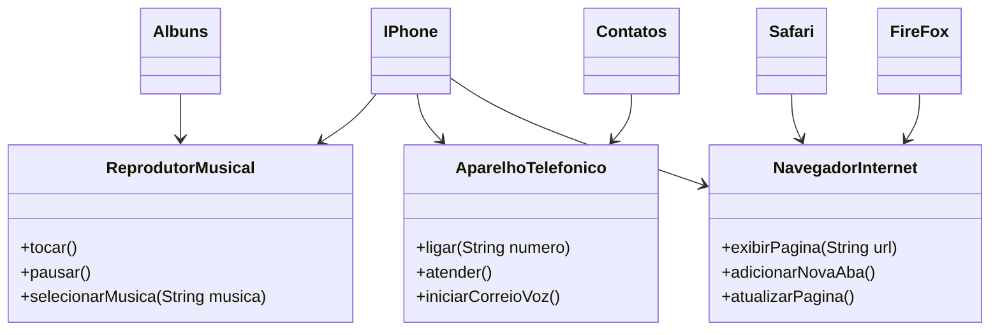

# dio-java-iphone

Esse é um desafio de um bootcamp da DIO em Java onde devemos estar Modelando o iPhone com UML: Funções de Músicas, Chamadas e Internet.

```mermaid
classDiagram
    class ReprodutorMusical {
        +tocar()
        +pausar()
        +selecionarMusica(String musica)
    }

    class AparelhoTelefonico {
        +ligar(String numero)
        +atender()
        +iniciarCorreioVoz()
    }

    class NavegadorInternet {
        +exibirPagina(String url)
        +adicionarNovaAba()
        +atualizarPagina()
    }

    class IPhone {
    }

    IPhone --> ReprodutorMusical
    IPhone --> AparelhoTelefonico
    IPhone --> NavegadorInternet
    Contatos --> AparelhoTelefonico
		Safari --> NavegadorInternet
		FireFox --> NavegadorInternet
		Albuns --> ReprodutorMusical
```
